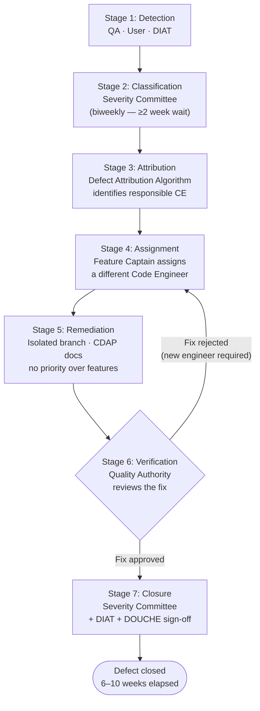

Other frameworks treat defect management as a simple triage process -- find the bug, fix the bug, move on. SADMF recognizes that defects are organizational events that require organizational responses. A defect is not merely broken code; it is evidence of a process failure, a training gap, a supervision lapse, or all three. The seven stages of DEPRESSED ensure that every defect is investigated with the rigor it demands and that the remediation addresses not just the symptom but the systemic conditions that allowed the defect to exist.

The DEPRESSED process consists of seven stages, each managed by a different team and each producing its own documentation artifact. **Stage 1: Detection** occurs when a defect is identified by the [Quality Authority](/roles/quality-authority/), a user, or the [DIAT](/roles/development-integrity-assurance-team/) during post-release validation. The defect is logged in the Defect Registry with a preliminary description and the name of the person who detected it. **Stage 2: Classification** is performed by the Severity Committee, a cross-functional body comprising one representative from the [System of Authority (SOA)](/roles/system-of-authority/), one [Feature Captain](/roles/feature-captain/), and one member of the [CRAP](/roles/change-rejection-or-acceptance-party/). The Severity Committee meets biweekly to classify each new defect according to the SADMF Severity Taxonomy (Critical, Significant, Moderate, Cosmetic, Philosophical). Classification typically takes 2 weeks from detection, as the Committee must reach unanimous consensus and must document their reasoning in the Severity Justification Memorandum.

**Stage 3: Attribution** uses the Defect Attribution Algorithm, the same algorithm employed by the [Tribunal](/release-convoy/ceremonies/tribunal/), to identify the [Code Engineer](/roles/code-engineer/) who introduced the defect. Critically, the attributed engineer is never assigned to fix their own defect. Allowing the original engineer to fix their own bug would create a conflict of interest: they have a personal incentive to minimize the defect's significance and to implement the quickest possible fix rather than the most thorough one. **Stage 4: Assignment** allocates the defect to a different Code Engineer, selected by the [Feature Captain](/roles/feature-captain/) based on availability, skill match, and absence of any personal relationship with the attributed engineer that might introduce bias. The assigned engineer receives a Defect Remediation Packet containing the defect description, the Severity Justification Memorandum, the attribution analysis, and the [Comprehensive Documentation Assurance Protocol](/practices/comprehensive-documentation-assurance-protocol/) templates for the fix.

**Stage 5: Remediation** is the actual fixing of the defect, which proceeds under the same [CI/CD/ED](/practices/ci-cd-ed/) constraints as any other code change. The assigned engineer works on an isolated branch, completes the CDAP documentation suite, and submits the fix for [Conflict Arbitration](/practices/conflict-arbitration/) alongside other changes. The fix receives no priority over feature work, as prioritizing defect fixes would create a perverse incentive for engineers to introduce defects in order to receive priority scheduling. **Stage 6: Verification** is performed by the [Quality Authority](/roles/quality-authority/), who tests the fix against the original defect description, the Severity Justification Memorandum, and the CDAP documentation. If the fix does not fully resolve the defect as classified, it is returned to Stage 4 for reassignment -- never to the same engineer, as they have already demonstrated an inability to remediate this particular defect.

**Stage 7: Closure** requires sign-off from the Severity Committee, the [DIAT](/roles/development-integrity-assurance-team/), and the [DOUCHE](/roles/devops-usage-and-compliance-head-engineer/). Closure sign-off confirms that the defect has been remediated, that the remediation has been verified, that the CDAP documentation is complete, and that the attribution record has been finalized in the [Tribunal](/release-convoy/ceremonies/tribunal/) Log. The entire DEPRESSED lifecycle, from Detection to Closure, typically spans 6-10 weeks for a Moderate severity defect. Critical defects follow an expedited path that reduces the Severity Committee deliberation period from 2 weeks to 1 week. The thoroughness of DEPRESSED ensures that the organization never confuses speed of resolution with quality of resolution, and that every defect leaves behind a complete paper trail that proves the organization learned from its mistakes.

## See Also

- [Tribunal](/release-convoy/ceremonies/tribunal/) for the ceremony that uses DEPRESSED attribution data
- [Quality Authority](/roles/quality-authority/) for the team that detects and verifies defects
- [Development Integrity Assurance Team (DIAT)](/roles/development-integrity-assurance-team/) for the team that co-signs defect closure
- [Comprehensive Documentation Assurance Protocol](/practices/comprehensive-documentation-assurance-protocol/) for the documentation required during remediation
- [CI/CD/ED](/practices/ci-cd-ed/) for the delivery constraints that govern defect fixes
- [Defects per Code Engineer](/metrics/defects-per-code-engineer/) for the metric that DEPRESSED attribution feeds
- [Strategic Test Deferral](/practices/strategic-test-deferral/) for the practice that increases DEPRESSED pipeline volume during high-velocity Convoy phases
